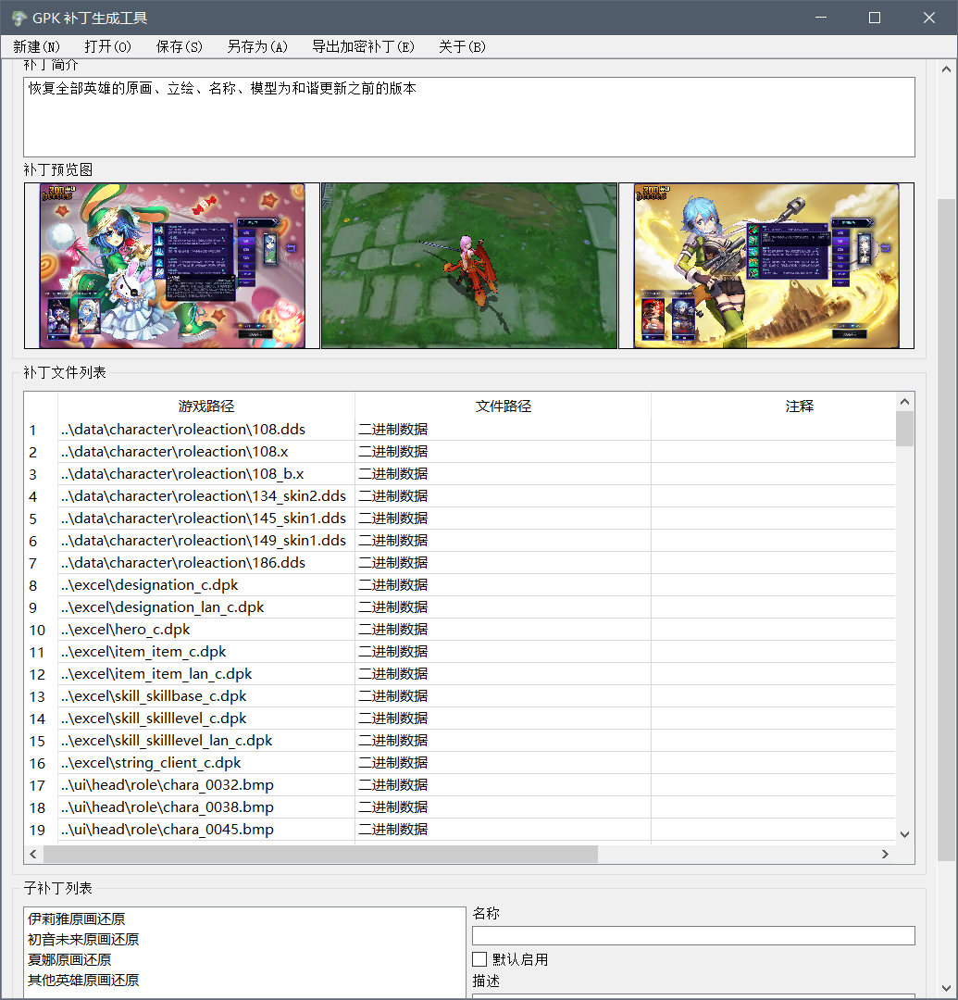
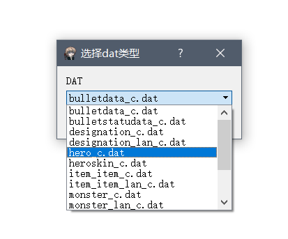

<div class="col-lg-12 text-center my-4">
	<h2 class="section-heading text-uppercase">使用方法 - 补丁作者篇</h2>
</div>

### GPK格式补丁的制作

动态补丁安装完成后，会在开始菜单中生成GPK生成器和DAT编辑器的快捷方式。 GPK的打包也很简单，具体使用方法可以看视频：
<a href="https://www.bilibili.com/video/av22642666">点击查看</a>

<div align=center class="my-4">
	
</div>

### 打包GPK时的一些注意事项

* 预览图的大小必须小于1280X720，而且长宽比必须是严格的16：9，否则都不会被软件读入。如果实在调整不好大小，用1280X720就可以了。
* 打包时可以不添加子补丁，所有文件可以正常加载。
* **加密补丁无法再被打包器打开，导出前请确定已留有备份！**

> 普通保存的GPK文件可以被打包器再次打开，意味着任何人得到文件后都可以提取文件，如果不希望别人能够提取文件的话，请导出加密补丁。

> 授权补丁是限制补丁使用者的一种方式，通过限制硬件ID来限制使用者。如果有意制作授权补丁的话，可以通过B站或者QQ联系我。

### 测试所用替换文件

安装动态补丁之后，在300英雄目录下会生成一个Replace文件夹，此文件夹将会被视为一个补丁进行加载。文件夹内文件的路径就代表了补丁内文件的路径，比如有一个文件的路径为：

```
\300英雄\Replace\data\audio\pick\pick102.bank
```

那么这个文件实际加载的路径为：

```
..\data\audio\pick\pick102.bank
```

**注意：此文件夹内的文件名或者文件夹名请全部使用小写！**

在此文件夹中编辑文件，将免去每次都必须用查看器打入jmp的麻烦。

### DAT文件的修改

安装动态补丁后，可以在开始目录中找到DAT编辑器。 注意，可以编辑的DAT文件是有限制的，打开DAT文件后需要选择相同名字的选项，若没有相同的选项则此DAT文件暂时无法编辑。

<div align=center class="my-4">
	
</div>

具体修改方法类似，可以在文件内进行查找和替换，不同的是此处字符串不再有长度限制。

**注意，尽量不要修改DAT文件的前3列，可能会造成加载失败！**

全部编辑完毕后点击导出保存为DPK文件，然后即可添加到补丁中。需要注意的是路径的填写，假设我们修改的DAT路径为：

```
..\excel\hero_c.dat
```

那么我们应该在生成补丁时填写的路径为：

```
..\excel\hero_c.dpk
```

简单来说，就是文件路径不变，将后缀改为dpk，才会被正确地加载。
