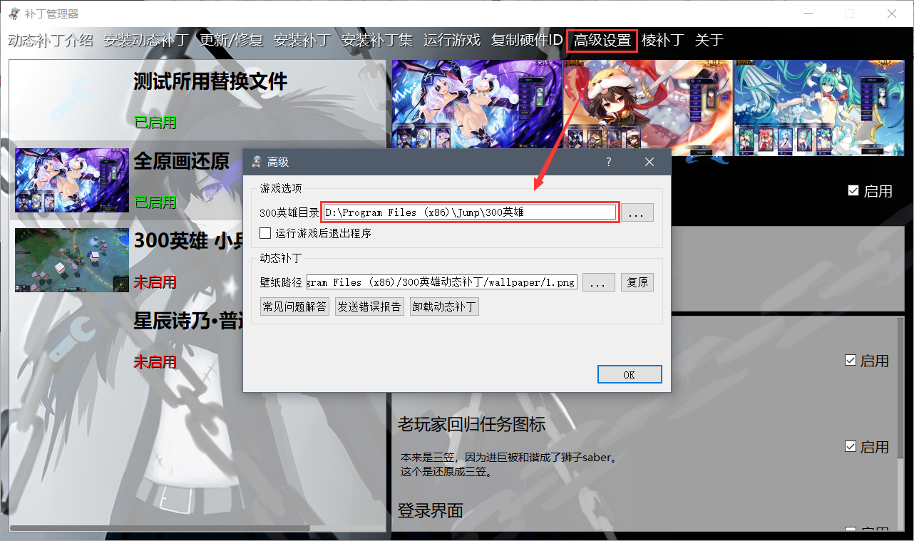
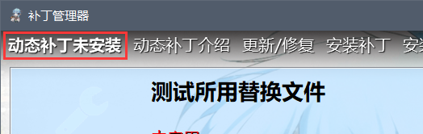
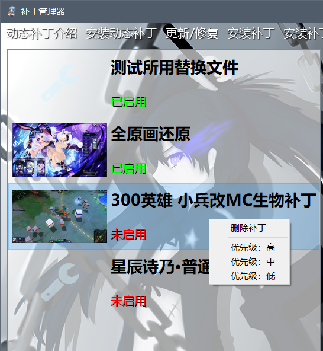
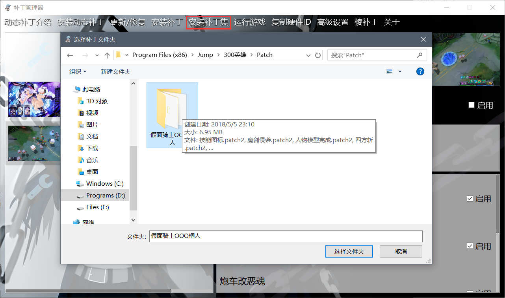

	<h2 class="section-heading text-uppercase">使用方法 - 玩家篇</h2>

### 动态补丁的安装

安装完成后，桌面会生成动态补丁的快捷方式。 打开软件，点击高级按钮，查看自动寻找的300英雄路径是否正确，若不正确需手动设置到正确的位置。

	

确认300英雄路径无误后，查看补丁管理器的左下角，正常情况下启动游戏右边按钮显示为黑色对勾，此时即可启动游戏。若显示为红色叉，请根据提示进行操作。

	

安装补丁后即可启动游戏，可以点击此处的启动游戏，也可以使用习惯的启动方式，包括直接双击图标启动和使用盒子等工具启动游戏。

配置完成之后强烈推荐将动态补丁的安装目录以及300英雄游戏目录均添加入杀毒软件的白名单，避免误杀导致软件失效。

* GPK格式的补丁文件图标是一片枫叶，直接双击文件即可安装。 
* 如果是PATCH2格式的补丁，需打开软件之后点击安装补丁按钮，然后选择补丁文件。
* 软件仅支持GPK格式与PATCH2格式，PATCH与PATCH3格式的补丁无法用动态补丁安装。
* 一次可以选择多个补丁一起安装哦~

### 已安装补丁的调整

> 优先级决定了如果多个补丁中文件产生冲突，优先加载的顺序。默认情况下，从上到下显示的补丁优先级一次升高。优先级更高的补丁中的文件将覆盖其他补丁中相同路径的文件。

如果需要调整补丁的优先级，选中一个补丁即可看到三个圆点，代表优先级分三个等级。白色圆点的个数越多，表示该补丁优先级越高。点击相应位置的圆点即可设置白点的个数。

如果需要删除一个补丁，点击白点右方的白色叉号即可。

	

多数GPK补丁文件都由多个子补丁构成，子补丁就是整个补丁中可以单独启用或者禁用的部分。玩家可以根据自己的喜好选择每一个子补丁是否启用。

如图右方所示，上方的启用按钮决定了整个补丁是否启用，若未勾选则下方的启用不会产生效果。下方的启用按钮即为每个子补丁的启用按钮，可以根据自身喜好自行调整。

### 补丁集的安装

> 补丁集是为了方便旧版本由多个patch2格式文件组成的补丁的安装而出现的补丁安装方式，它将一个文件夹内部的所有patch2文件视为一个补丁，每一个文件对应一个子补丁。

要安装补丁集，请事先将所有patch2文件放到同一个文件夹内，然后点击安装补丁集并选择此文件夹：

	

### 动态补丁的卸载

要卸载动态补丁，首先打开软件，点击软件左下方启动游戏右边的按钮，在按钮变成黄色之后退出软件，在系统的卸载或更改程序中找到300英雄动态补丁并卸载。**请勿直接运行安装目录下的卸载程序，直接运行无法卸载程序。**

卸载软件前未删除的补丁将会保留，下一次安装软件仍可看到之前安装的补丁。
